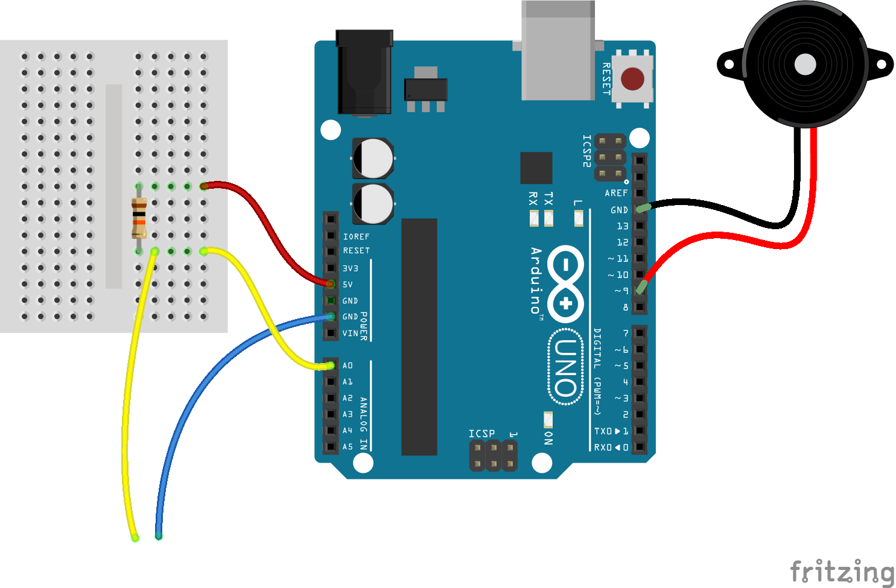

# Crayon sonore

### Projet Arduino permettant de réaliser un circuit électronique de dessin sonore.

Matériel requis :

* une carte arduino
* un crayon en graphite
* un haut-parleur piezo
* une résistance 10k
* une plaque de prototypage
* du fil électronique
* un câble croco

